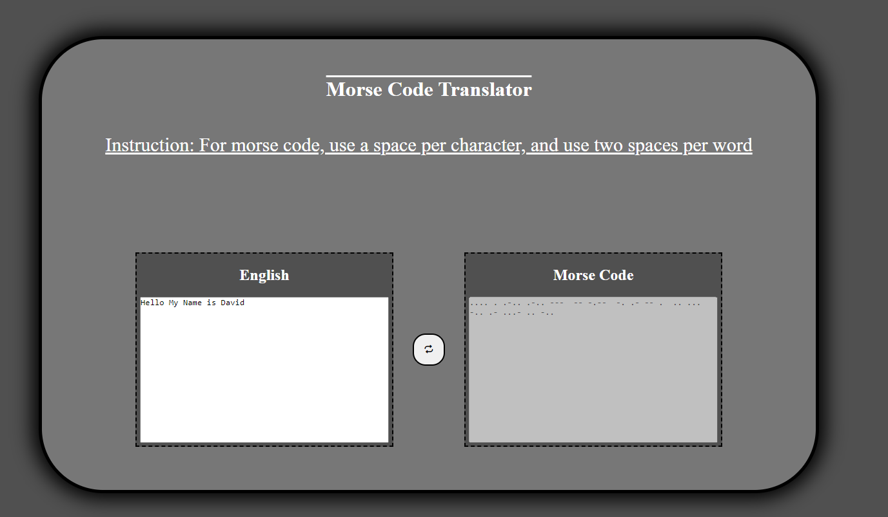

# Project_MorseCode-Translator

## Description

A general morse code program, allowing users to simply write out morse code and english with ease without the annoying dash needed per word when writing morse code like other morse code projects

## Preview

## Setup

Simply either go into the Repo and launch the gitpages, or launch it and run the project as a live server

## Developer Notes

-   Once again simplicity was kept in mind, and so simply using strings and then parsing them through the morse key dictionary object, and looking at its value, when we want to switch english to morse code, simply switch the value and its key, and vice versa

### Struggles

-   Only struggle i had with the project was when i encountered an error while trying to get tests to run correctly as well as return the correct value, a simply solution of setting the key inside of the morsecode translator.js file which deals with all the logic, and return the same list, allowing tests to read it as well as being able to set it as i wasnt able to set it inside of the html file and would get messy pretty quick

### Current Issues

-   Only issue that has been found is simply the ugliness of it all, needs a refactor on its colors etc, its pretty bland

### Later Updates

-   A possible auto capitalisation with a dictionary API would be nice, allowing users to keep most of their capital letters even through the morse code translator
